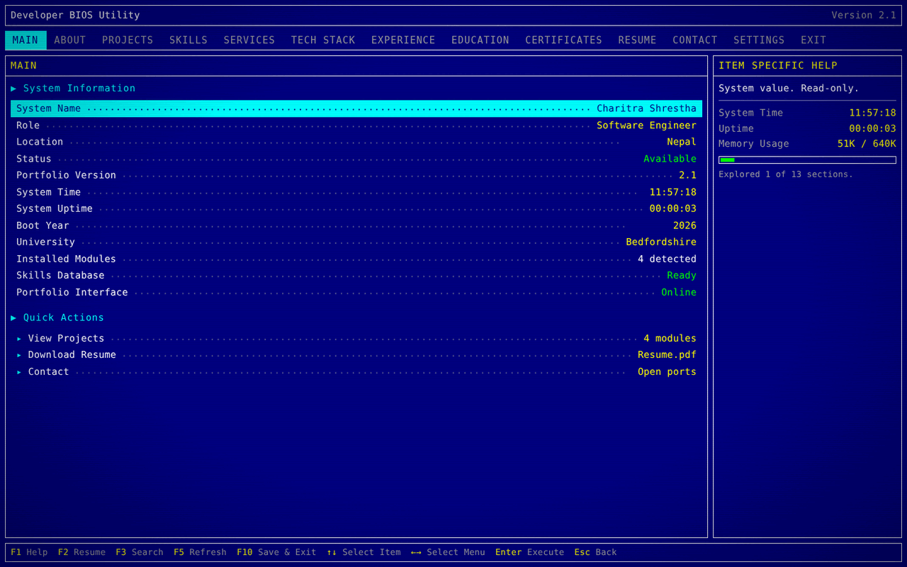
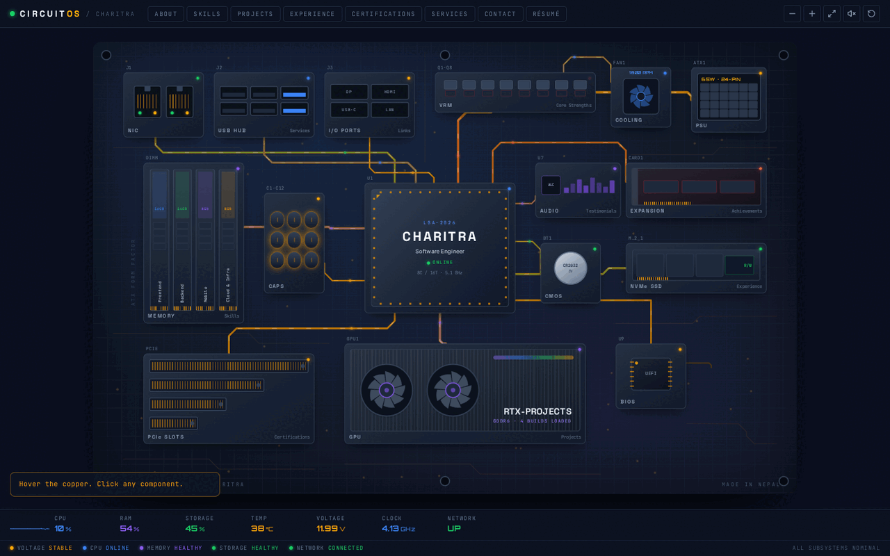
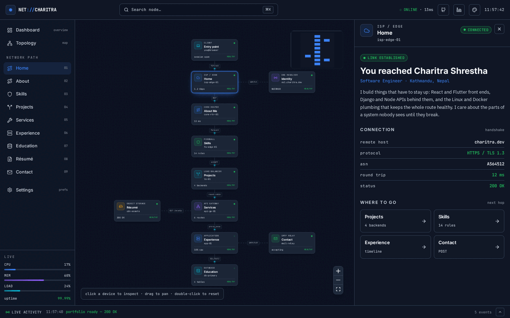
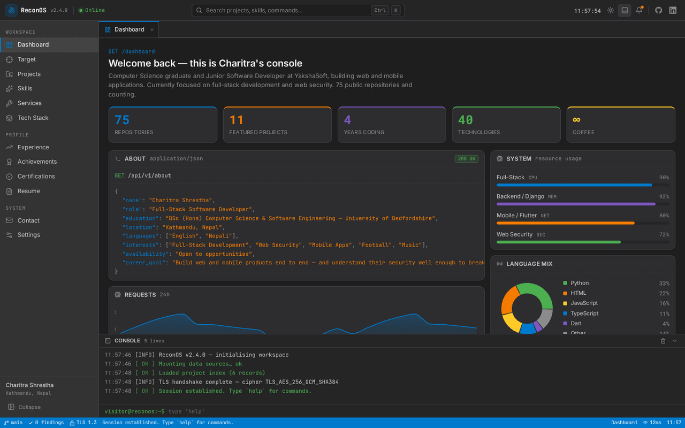
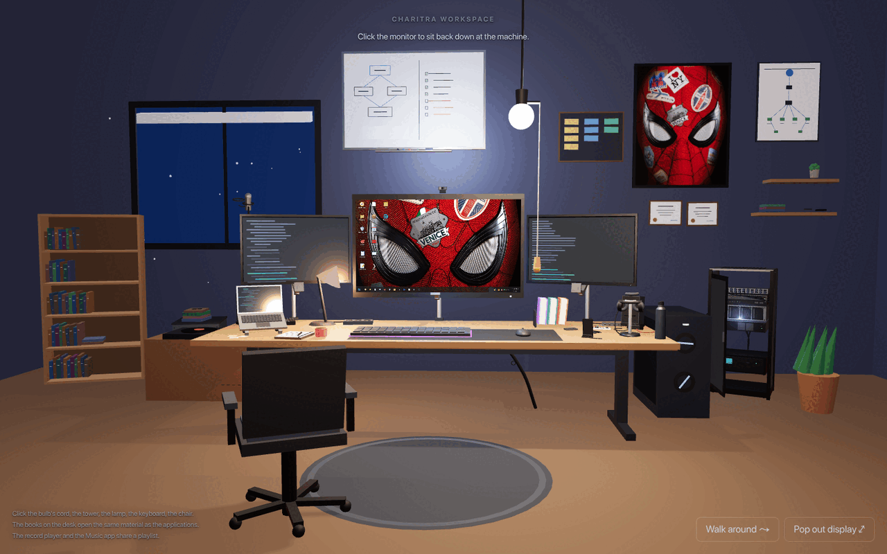
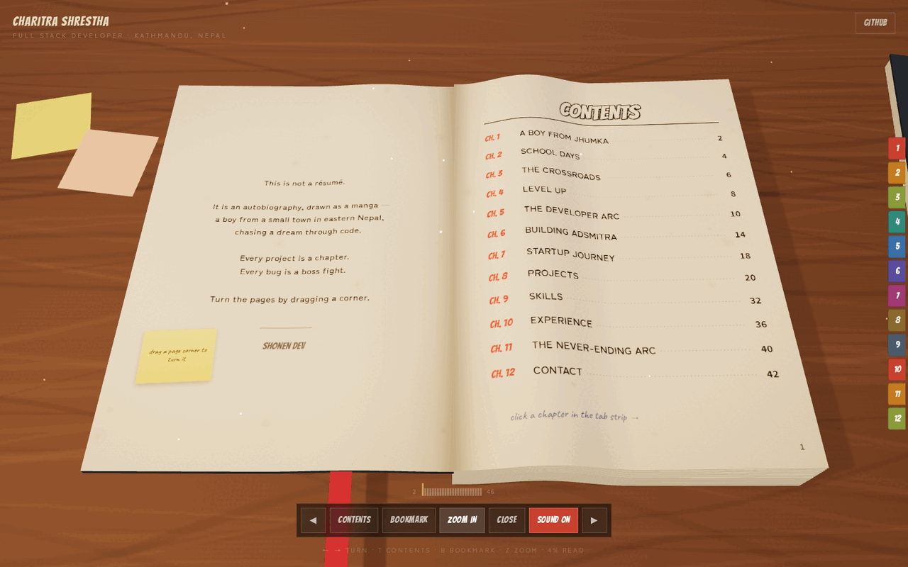

# Portfolio Machines

Seven portfolio templates. Six of them are developer portfolios built as **machines** instead of
landing pages — a firmware setup screen, a motherboard, a network topology, a security console, a
desktop OS, and a printed manga volume. The seventh is a working photographer's studio site.

They're meant to be taken. Every one keeps all of its content in one or two data files, so
turning a template into *your* portfolio is an edit, not a rewrite. MIT licensed, no attribution
required.

**▶ [Live demos — all seven in one place](https://charitraa.github.io/Portfolio/)**

---

## The seven

| | Template | What it is | Stack |
| --- | --- | --- | --- |
| 01 | **[Developer BIOS Utility](apps/bios)** · [demo](https://charitraa.github.io/Portfolio/bios/) | Visitors boot the machine, watch it detect a developer, then browse the résumé as if editing BIOS settings. Keyboard-driven. | Vanilla JS — **no build step** |
| 02 | **[CircuitOS](apps/circuitos)** · [demo](https://charitraa.github.io/Portfolio/circuitos/) | An interactive PCB that boots *you* instead of an OS. The CPU is the engineer; every other component is a section, wired with animated copper traces. | React 18, Tailwind v4, Framer Motion |
| 03 | **[NET://](apps/net-topology)** · [demo](https://charitraa.github.io/Portfolio/net-topology/) | The visitor is a packet — ISP edge, DNS, firewall, load balancer, database. Every device on the map is a section. | React 19, xyflow, Tailwind v4 |
| 04 | **[ReconOS](apps/reconos)** · [demo](https://charitraa.github.io/Portfolio/reconos/) | A security operations console: persistent tabs, a working command bar, a resizable log panel, views that present as HTTP responses. | React 19, Router, Recharts, Vitest |
| 05 | **[Workspace OS](apps/workspace-os)** · [demo](https://charitraa.github.io/Portfolio/workspace-os/) | A room with a computer in it. Pull the bulb's cord, press power, watch it POST, land in a desktop where every section is an app — running on the monitor in CSS 3D. | React 19, three.js, R3F |
| 06 | **[My Story, Vol. 01](apps/manga-book)** · [demo](https://charitraa.github.io/Portfolio/manga-book/) | A career told as a manga volume you page through. Every spread is inked at runtime onto a canvas — panels, screentones, speech bubbles and all. | React 19, Canvas 2D, three.js |
| 07 | **[Dharshan Studio](apps/photographer)** · [demo](https://charitraa.github.io/Portfolio/photographer/) | The one that isn't a developer portfolio — a working photographer's site. Cinematic hero, a filterable contact-sheet gallery with a lightbox, packages, and an enquiry form that carries the chosen package. | Vanilla JS — **no build step** |

Not sure which one? **[docs/comparison.md](docs/comparison.md)** puts them side by side — payload
size, dependency count, accessibility, and what each one is actually good for.

---

## What they look like

| | |
| --- | --- |
| **01 · Developer BIOS Utility** — the MAIN page of the setup utility<br> | **02 · CircuitOS** — the board, powered up<br> |
| **03 · NET://** — the topology, inspecting the ISP edge<br> | **04 · ReconOS** — the dashboard view<br> |
| **05 · Workspace OS** — the room, with the session live on the monitor<br> | **06 · My Story, Vol. 01** — the contents spread<br> |
| **07 · Dharshan Studio** — the hero, above the fold<br> | |

---

## Making it yours

Pick one, run it, edit its data file. That's the whole workflow.

```bash
git clone https://github.com/charitraa/Portfolio.git
cd Portfolio/apps/reconos      # or circuitos · net-topology · workspace-os · manga-book

npm install
npm run dev                    # http://localhost:5173
```

`apps/bios` and `apps/photographer` are the exceptions — no dependencies, no build, just files:

```bash
cd Portfolio/apps/bios
python3 -m http.server 8000    # http://localhost:8000

cd Portfolio/apps/photographer
node serve.mjs                 # http://localhost:5173
```

### Where the content lives

Each template deliberately funnels every piece of personal content into a small number of files.
Nothing outside these needs to be touched to ship your own version.

| Template | Edit these |
| --- | --- |
| `bios` | `assets/js/data.js` |
| `circuitos` | `src/data/content.ts` |
| `net-topology` | `src/data/profile.ts` |
| `reconos` | `src/data/profile.ts`, `src/data/projects.ts`, `src/data/skills.ts` |
| `workspace-os` | `src/data/portfolio.ts` |
| `manga-book` | `src/content/story.ts` |
| `photographer` | `assets/js/data/*.js` — seven small files, one per section |

Drop your own `resume.pdf` (and, where the template uses one, `avatar.jpg` / `wallpaper.jpg`)
into that app's `public/` folder — `bios` reads its résumé from its own folder instead.
`photographer` is the outlier: it wants photographs rather than a résumé, and its gallery entries
take either an Unsplash id or a path to your own file. Each app's README covers the details.

### Shipping it

Every template builds to a plain static bundle, so any static host works — GitHub Pages,
Netlify, Vercel, Cloudflare Pages, an S3 bucket.

```bash
npm run build      # → dist/
npm run preview    # serve the built output locally
```

If you deploy to a **subpath** (e.g. `example.com/portfolio/`), set `BASE_PATH` at build time:

```bash
BASE_PATH=/portfolio/ npm run build
```

At the domain root you don't need it — `/` is the default.

> **Single-page routers:** `reconos` uses client-side routing, so its host needs a rewrite of
> unknown paths to `index.html`. Its `vercel.json` and `public/_redirects` already do this for
> Vercel and Netlify; the Pages workflow here writes a per-directory `404.html`.

---

## Repository layout

```
apps/
  bios/           firmware setup screen   (static, no build)
  circuitos/      motherboard             (Vite + React 18)
  manga-book/     manga volume            (Vite + React 19)
  net-topology/   network map             (Vite + React 19)
  photographer/   photography studio site (static, no build)
  reconos/        SOC console             (Vite + React 19)
  workspace-os/   3D room + desktop OS    (Vite + React 19)
site/
  index.html      the gallery landing page
screenshots/      one capture per template, used by this README
docs/
  comparison.md   size, features and trade-offs, side by side
.github/workflows/
  deploy.yml      builds all seven + the gallery, publishes to GitHub Pages
```

Each app is fully self-contained — its own `package.json`, its own lockfile, its own README.
There is no root-level workspace, nothing shared between them, and no build order. You can
delete the six you don't want and the seventh still works.

## Publishing the demos yourself

If you fork this, the demo site builds itself. Push to `main` and the workflow does the rest — it
turns Pages on through the API on its first run, so there is no settings page to visit.

The workflow resolves the correct base path from your repo name, so it works whether you keep
the name `Portfolio` or rename it — and whether it's a project site or a `<user>.github.io` one.

> If that first run fails on **"Get Pages site failed"**, your account or organisation blocks the
> API from enabling Pages. Turn it on by hand once — **Settings → Pages → Build and deployment →
> Source: GitHub Actions** — and re-run the job.

## Author

**Charitra Shrestha** — Full-Stack Software Developer, Kathmandu, Nepal<br>
BSc (Hons) Computer Science & Software Engineering, University of Bedfordshire

[Website](https://www.charitrashrestha.com.np/) ·
[GitHub](https://github.com/charitraa) ·
[LinkedIn](https://www.linkedin.com/in/charitra-shrestha-78245b270/) ·
[dev.to](https://dev.to/charitraa) ·
[LeetCode](https://leetcode.com/charitraa/) ·
[Email](mailto:code@charitrashrestha.com.np)

The templates ship filled with my details so you can see what a finished one looks like. Swapping in
your own is the one edit each README opens with. `photographer` is the exception — it ships with a
real studio's details, and its README lists what to check before publishing it as your own.

## License

[MIT](LICENSE). Use them, change them, ship them commercially. No attribution required.
